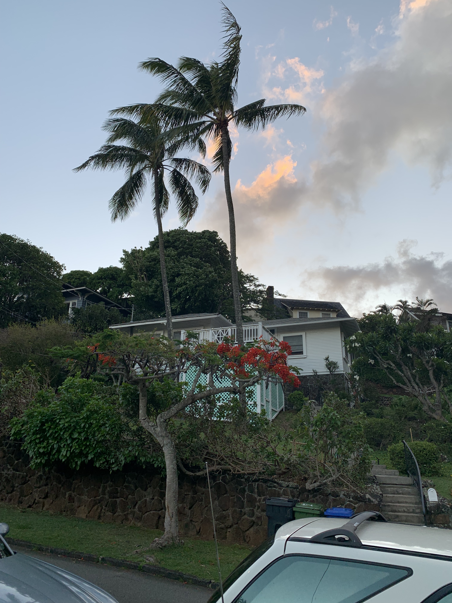
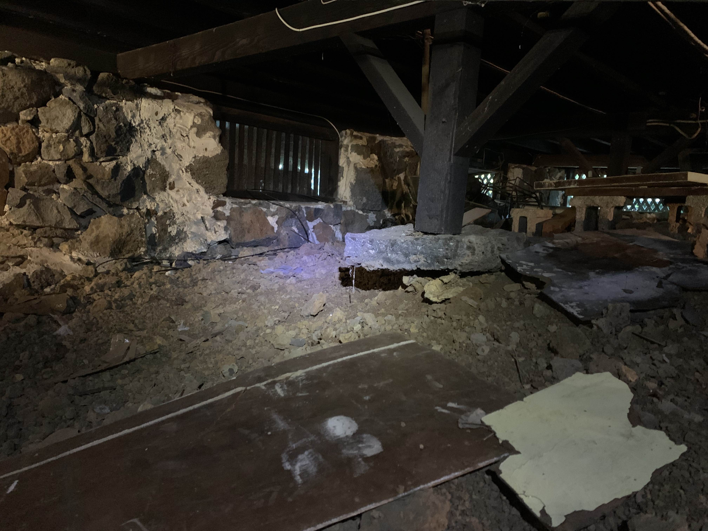
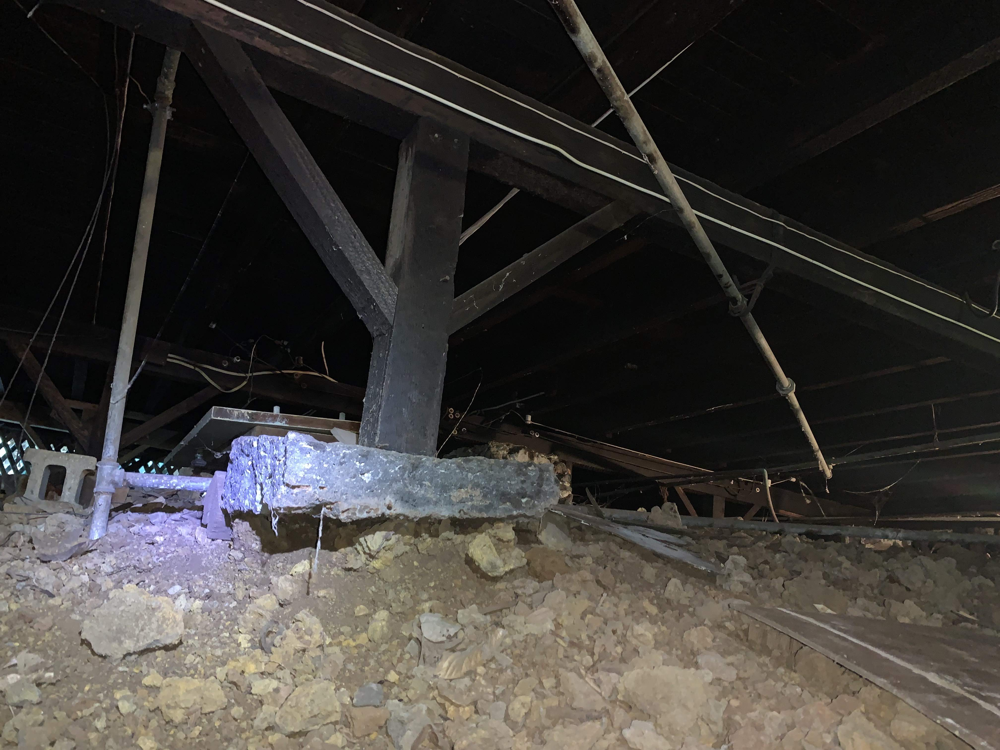
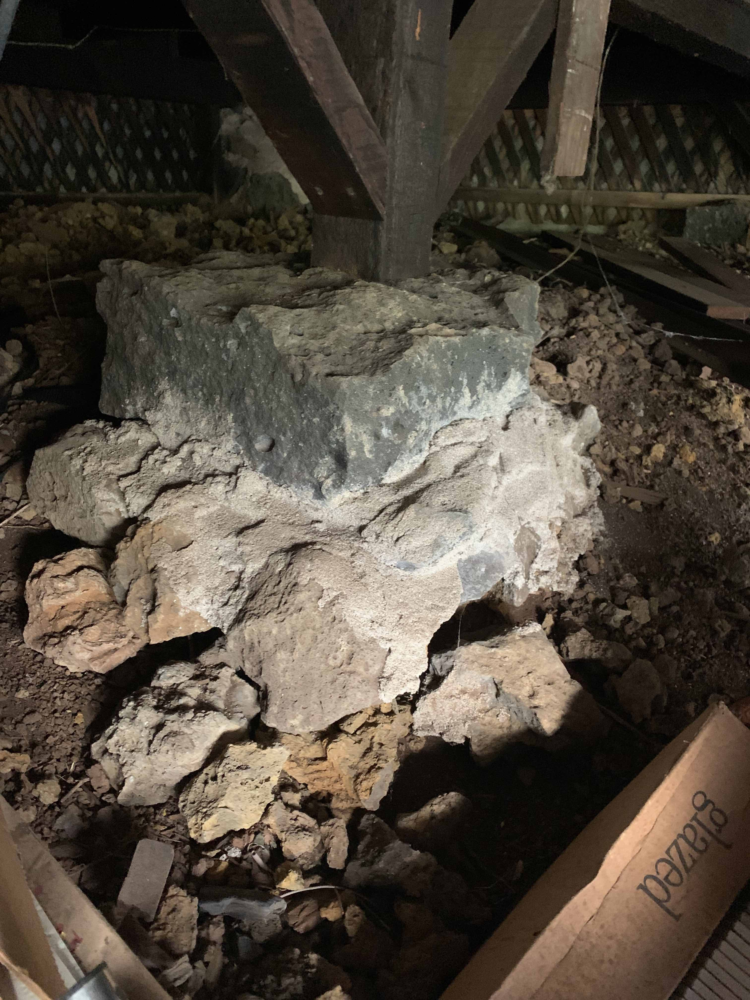
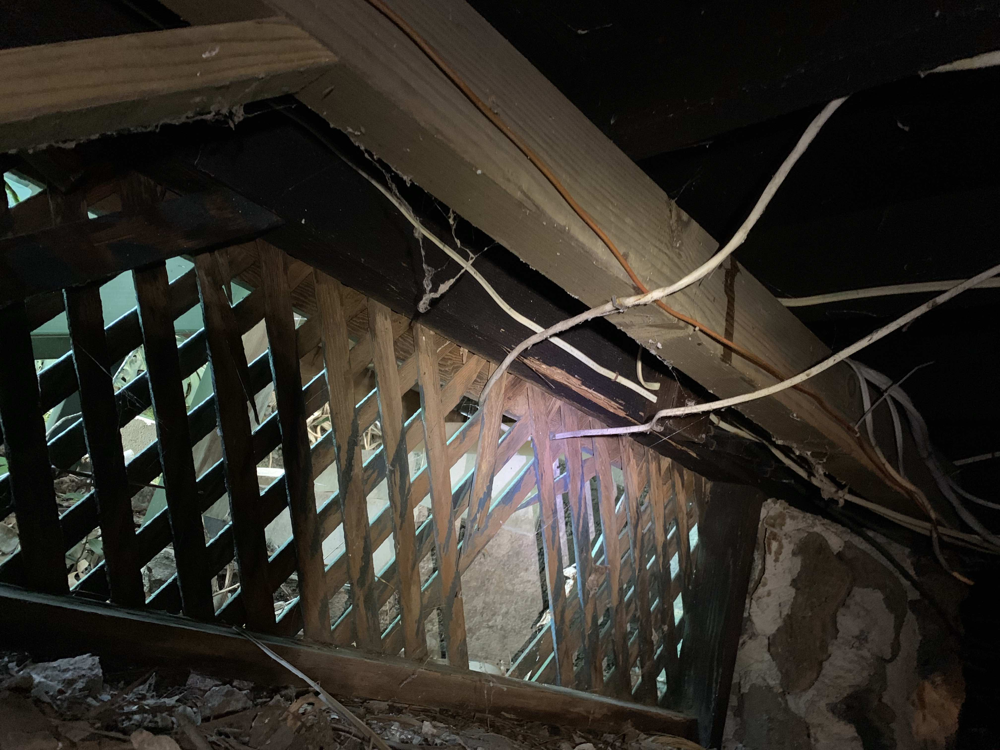
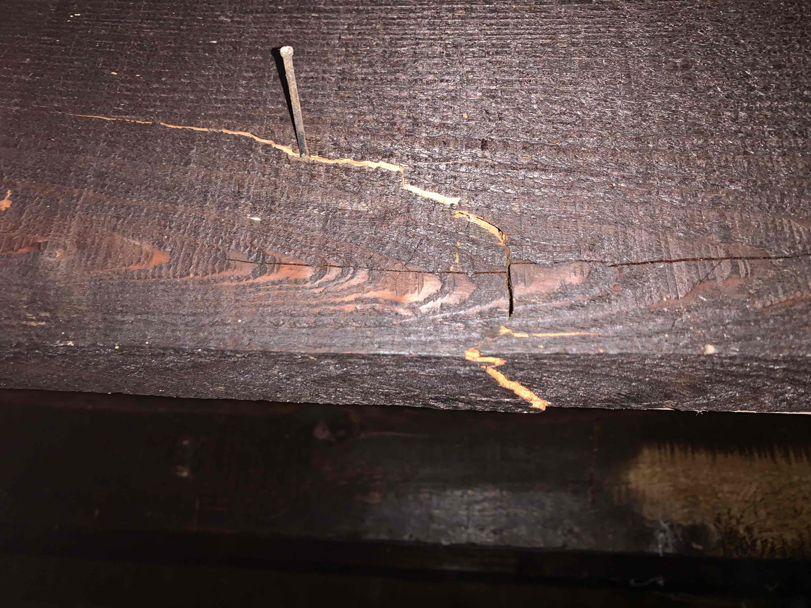
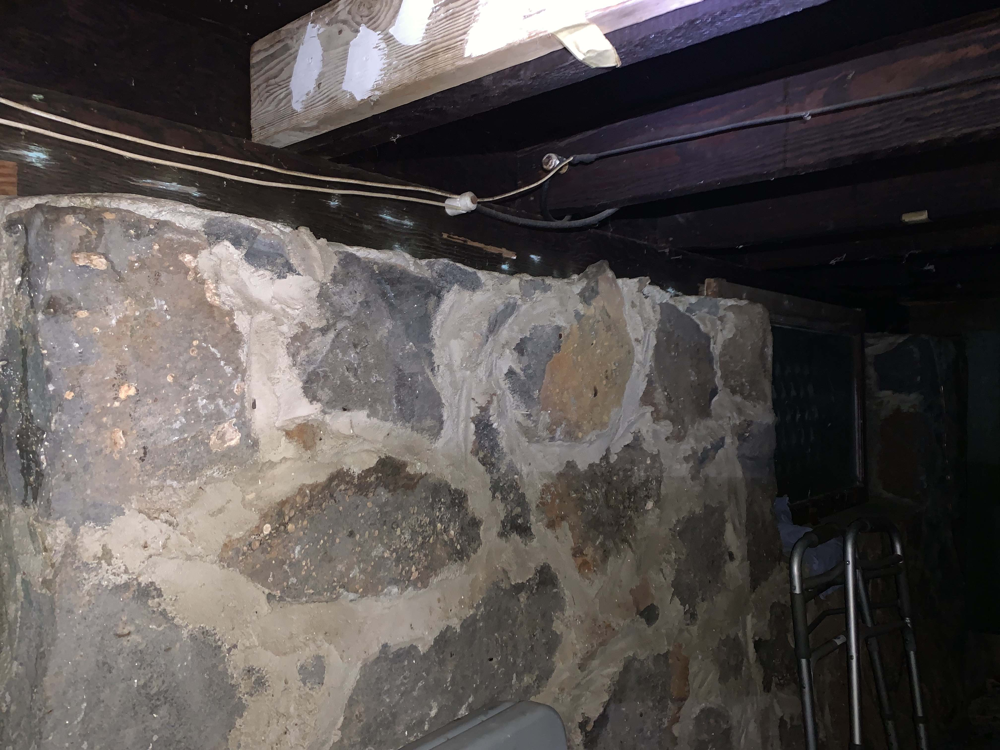

# Foundation Assessment of 2386 Liloa Rise

The house at 2386 Liloa Rise was build in 1922. The structure has held up well in spite of its age. However there are some areas of concern that the owners Dan Heslinga and Germaine Uehara would like inspected. 

This is a split-level structure with a pier and post foundation and crawl space. 

- Exterior view of house:

The foundation of the home is rock wall along the perimeter and pier and post in the crawl space. There are two piers that are cause for concern, pictured here:

- Eroded pier and post under living room (two views):

- Eroded pier and post under the master bedroom:

In addition there are two floor joists that appear to have been reinforced, as shown in these photos:

- Under the makai side of the house:

- Under the sun room (crack):

- Under the sun room (reinforcing beam):

In spite of these areas, there are no cracks in the interior walls nor misaligned doors or windows. The floors seem level. 

##Scope of work

The owners request and assessment of foundation: Is it secure, or can it be made secure? In addition to the areas or concern we request a inspection of the whole of the foundation and floor joists. This assessment should state any remedial work that may need to be done as well as an estimate of the cost of the proposed work. 

We appreciate your expert advice!

